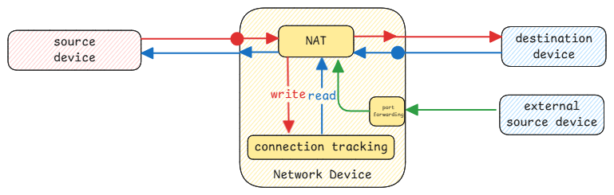

# Network Address Translation

This is used everywhere whenever a single external facing network must be shared between multiple devices.

For example, in a home network, there is a single public IP address assigned by the ISP.
In case of container networks, all containers share the same IP address as the host machine when packets are sent out.

## Connection Tracking

This is part of every device that does NAT.
It keeps track of all outgoing connections and the corresponding incoming connections.

When a packet is sent out, the source IP address and port number is replaced
with the external facing IP address and a unique port number.
This mapping is stored in the **connection tracking** table.

When a response packet is received, the destination IP address and
port number is **looked up** in the connection tracking table and
replaced with the original source IP address and port number
for which the response is received before forwarding it to the internal device.

## Port Forwarding

It's an sub-type of NAT where incoming packets to a specific port on the external facing IP address
are forwarded to a specific internal IP address and port number.

:::danger Port Forwarding is for incoming connections
Port forwarding concept is purely about incoming connections.
It handles how the request is mapped to different IP and forwarded to the internal device.
:::
