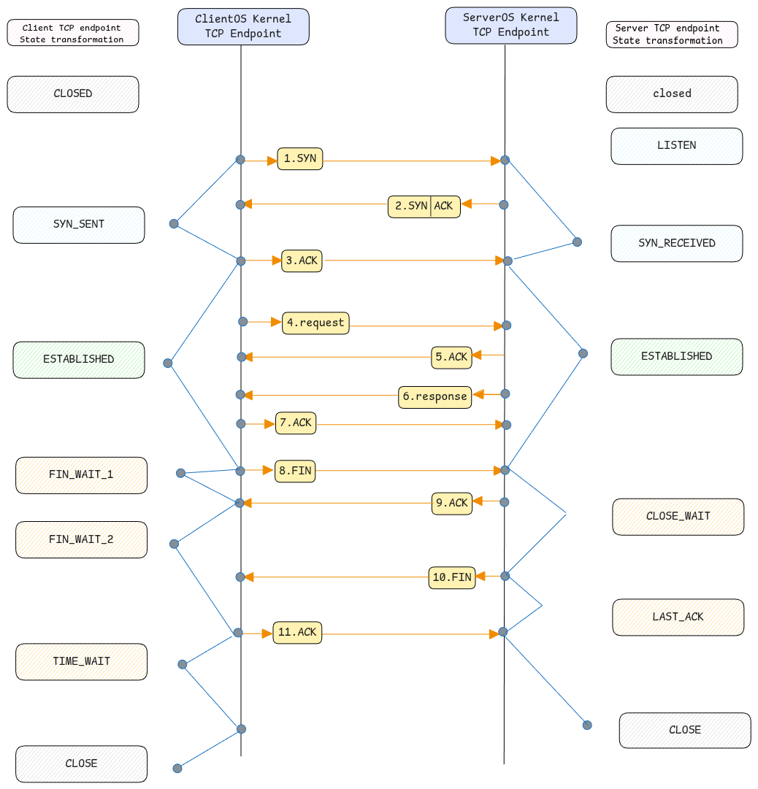

# TCP vs UDP

TCP is always mentioned as reliable and UDP as unreliable.
This learning is focused on understanding what does this exactly mean.

:::info Everything is same at network layer

1. TCP and UDP are transport layer protocols.
2. At network layer, they're just regular IP packets.
   :::

## Network stack

Every IP packet that's sent by the network layer contains the information
if the packet is part of a TCP or an UDP connection.

When the network layer receives a packet, it checks the protocol type and
forwards the packet to the respective transport layer stack - TCP or UDP.

:::important acknowledgement packets

In TCP, there is no acknowledgement packets for each segment.
The receiver decides to send acknowledgement after certain intervals with a specific segment number.
Then it means, it has received all segments until that number.
:::

## Kernel Responsibilities

1. Entire session establishment, maintenance and teardown is handled by the kernel.
2. Kernel's network stack maintains a connection table for all active connections.
3. Kernel handles the full handshake process for TCP connections.
   Only after the handshake is complete, the application is notified of a new connection.
4. Kernel handles packet sequence, retransmission, acknowledgements, flow control and congestion control.
5. Kernel handles packet reordering and duplicate packets.
6. Kernel handles packet loss and corruption.
7. Kernel handles fragmentation and reassembly of packets.
8. Kernel handles buffering of packets.

## Application Perspective

For the application, the entire network protocol is completely abstracted away.
The application just writes entire stream of data to a socket
and reads entire stream of data from a socket.

The network stack then takes care of breaking the stream into packets,
sending the packets, receiving the packets, reassembling the packets
and providing the stream to the application.

:::danger Shared buffering responsibility
Even though the kernel handles buffering of packets to the receiver,
the application is still responsible for buffering data at the application layer.

For example, if the application tries to send a huge file and
the network or the receiver is slow.
Then the connection's socket buffer will fill up and application can't write anymore data.

In such cases, the application uses epoll to be informed again when the socket is available for writing again.
:::

## TCP - Transmission Control Protocol

In this protocol, there is a session established between the actual sender and receiver.
This happens spans across multiple devices and networks.

:::warning Just regular IP Packets
For the actual network layer, these are just regular IP packets.

The routers and switches don't care if the packet is TCP or UDP or if they're even handshake packets.
They're just forwarded based on the destination IP address.
:::

## UDP - User Datagram Protocol

UDP is a connectionless protocol.
There is no session established between the sender and receiver.
Every packet is just sent across and the receiver receives and processes the packets as they arrive.

:::tip lightweight protocol
UDP is a lightweight protocol as

- there is no overhead of connection establishment, maintenance and teardown.
- IP Packets don't contain the TCP header which has sequence number, acknowledgement number, flags etc.
  :::

:::info meaning of Datagram
It comes from the word "telegram" which is a short message sent over a long distance and
every message is independent of each other and has no relation to each other.
:::

## NAT

In case of NAT also the kernel needs to process TCP messages.

1. When there is a SYN packet, the kernel needs to create a new NAT mapping for the connection.
2. When the connection is closed, the kernel needs to remove the mapping from the entry table.

:::danger necessary to delete entries
If the NAT doesn't delete entries, then the table just grows big and ends using up memory.
:::
