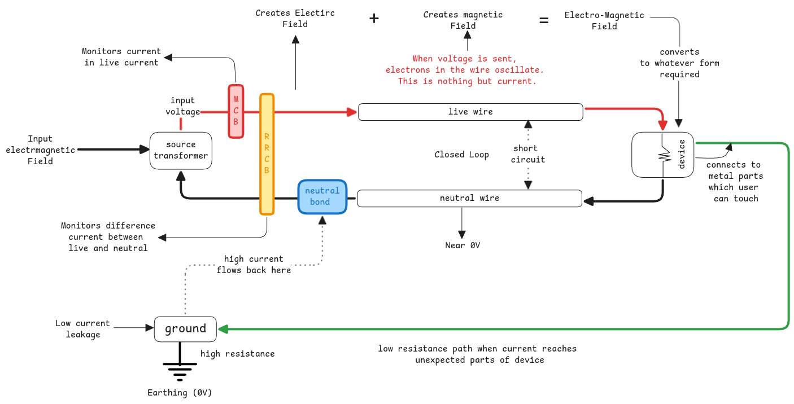

# Current Flow

What flows is the electromagnetic fields that travels through the electrons using it as a medium.

:::warning Electron Movements
when voltage is provided, the electrons start to oscillate in the wire.

One electron oscillates and it triggers the next one.
:::

When we say current flows, it means how the electrons oscillate and move the electric field
from one electron to other thereby covering the entire wire.

## Current

More current means, more magnetic field.
So the device with low resistance means it simply lets more magnetic field to be generated
and this is across the entire live wire, from source until the device.

:::tip How to image current
Whenever current is mentioned,
just imagine the flow of electrons where flow is controlled by the difference in voltage.
The more the difference, the electric field will push/pull electrons accordingly.  
:::

## Voltage

It 's not something physical to be measured.
It's just the difference between two points in the circuit.

:::tip what's physical
Current is physical because it's the flow of electrons.

:::

## Constant Input Voltage

The input voltage coming from the main source outside of the house is always same.
The difference comes only in the current flow which is determined by the load connected to the circuit.

If more devices are connected, the current flow increases.
Also depends mainly on the **resistance** of the device which decides how much current it really needs to generate.

:::info Input Voltage Specifications
When describing an input, we always mention only the voltage because that's the only thing the transformers can control.
The current is something that adjusts automatically based on load (ohm's law).
:::

## Closed Circuits

For the current to flow, the circuit must be a closed loop.
This means, the electromagnetic waves must just move out of the live wire so that the new waves keeps flowing.

## Short Circuit

Happens when live and neutral wire touches each other is called a short circuit.

:::danger short circuit versus electro magnetic fields
EM fields are always extended between live and neutral wires.

But shorting will cause very high current to be generated

:::

The neutral wire has no resistance and this causes heavy surge in the current flow (Ohms law).
To avoid further damage, the MCB trips.

:::info How MCB Monitors
When live wire touches the neutral wire, the current flow increases since the neutral wire has zero resistance.

The MCB sees that the current drawn from the wire is way higher than the allowed levels.
:::

## Analogies

1. Water flows inside pipes. But the current flows around the wire.
2. The AC current flows like an Mexican wave in stadium. It must be closed loop for the new wave to come in.
