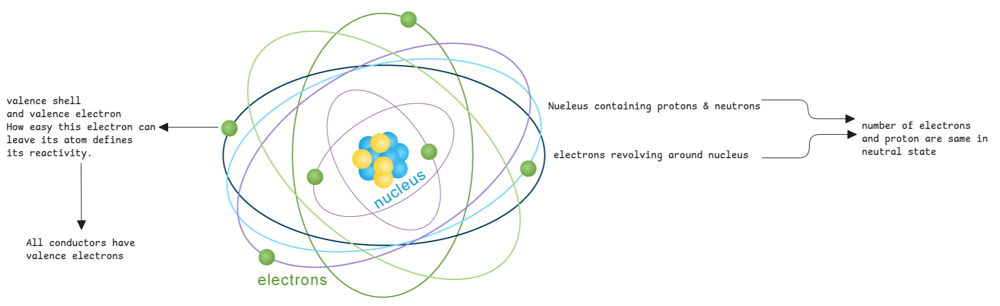
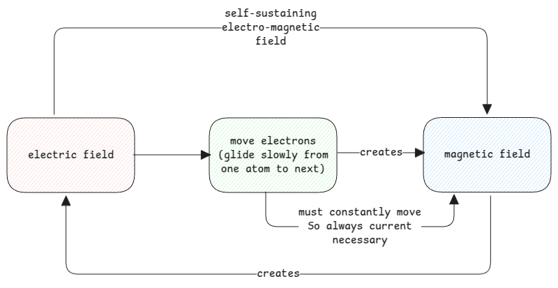
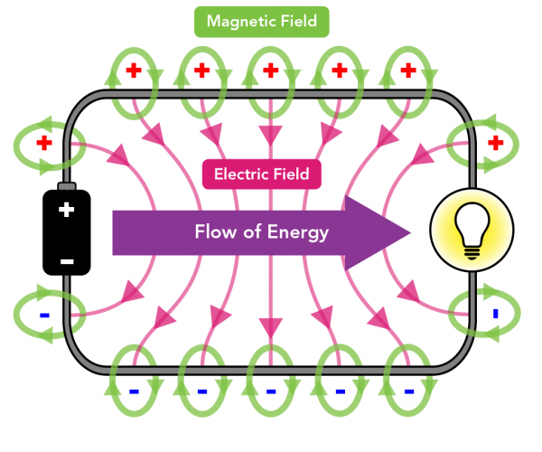

# Electrical Energy

## Analogy with gravitational energy

In case of gravitation, when we lift an object up, its gaining gravitational potential energy
which is converted to kinetic energy by the gravitation force which pulls the object to it.

Similarly in case of electric field, the free electrons in the conductor gains kinetic energy from the electric field.

:::info gravitational vs electric field
Electric field is created by separating positive and negative charges.
Once created, the electron has gained potential energy and will try to move back to it's original place.
:::

## Atoms

## Electromagnetic Field

**Electric field** - It's always there between electrons and protons and also between atoms.
But in normal case the field is neutral since the same force is applied on both positive and negative charges.
So the net field is zero.

- This is what holds the atom together.
- This is also between atoms.

:::tip Electric field between atoms
Even though the field within an atom results in net zero,
the field between atoms isn't zero.
:::

**Magnetic field** - This is created by the movement of electrons.
When electrons move, they create a magnetic field around them.

:::warning charged particle vs ion
Charged Particle - Any particle that has a positive (such as a proton) or a negative (such as an electron) electric charge.

Ions - Any atom or molecule that has a net positive or negative charge due to the loss or gain of one or more electrons.
:::

## Field Propagation

When we turn on a switch, the device starts working immediately.
It's important to understand what happens here.

1. The voltage difference creates electric field.
2. This causes the electrons to drift a bit.
3. This moving electron causes magnetic field.
4. It then creates a change reaction, where the moved electron again creates electric field and
   that further pushes electron creating magnetic field.

This shift of EM field happens almost at the speed of light when the circuit is closed.
The closed circuit provides a way for the electric current to flow and thereby generate a constant EM field.

:::tip current is always necessary
Even though the energy transfer happens via the electromagnetic field around the wire,
current is still necessary.

This is because, **if the electron doesn't move then there is no magnetic field.**
If there is no magnetic field, then there is no energy transferred.

This is exactly why, when a switch is off - the circuit is open and the current can't flow after a specific point.
So there is no magnetic field.
:::

## Field between cables

Also, the magnetic field isn't between individual lines.
Its spread between the wires connecting the source and the load.

:::danger Magnetic fields cancel out but electric field stay
The magnetic fields are mostly within it's wire and doesn't spread across the negative wire.
Even if it does, it will cancel out since they will be in opposite directions.

But the electric fields are always between the live wire with the actual voltage and neutral which is at 0V.
This difference is what attracts charges and causes current.

[picture source](https://letstalkscience.ca/educational-resources/stem-explained/does-living-near-high-voltage-power-lines-cause-cancer)
:::

## Energy Transfer

The electromagnetic field is the one carrying energy to devices.
This field when reaches the device, will exert forces on the free electrons in the device material and
convert it into any other form of energy such as heat, light, etc.

The best analogy to think of it to a water standing in a pipe with tap closed.
The moment the tap is opened and there is pressure quickly pushes and
water flows out.

:::warning common misconception about electrons
It's a common misconception that the electrons are carrying energy. This isn't true.

Current which is nothing but electron flow is only to generate magnetic field.
:::

## Voltage, Current and Power

Voltage and current are directly proportional.
This is why we use high resistance to control the current in a circuit.

:::important Ohms law
**V = I \* R**

Where V is voltage, I is current and R is resistance.
So the wires are ensured to have very high resistance so that the current is low.
:::

While transferring very high voltage from a power grid,
it's ensured that it generates low current.
This is done by controlling the load that's drawing the energy.
If ensures an optimum power is transferred to the load, so that the current remains in safe limits.

:::danger why current must be low
In case of power grids, if the current is high,
the wires will heat up and melt and also the energy is already lost in the form of heat.
:::

:::tip Power, Voltage and Current Useful Analogy

Consider a big heavy box.
Higher voltage means you're pushing harder.
Higher current means you're pushing faster.
The resistance is the weight of the box.
The power is the amount of energy you're able to invest (on average in a set amount of time).

Bigger weights mean you have to push stronger to move the box (higher voltage).
Given a fixed amount of power available, you're going to move the weight slower (lower current).

[source can be found here.](https://www.reddit.com/r/explainlikeimfive/comments/r3hj8c/comment/hmbfo00/?utm_source=share&utm_medium=web3x&utm_name=web3xcss&utm_term=1&utm_content=share_button)
:::

## Why does low resistance result in more current?

Think of an electric field as a "push" that tries to move electrons. Resistance is what opposes this push. So:

- If resistance is high, the electrons struggle more to move - so less current flows.
- If resistance is low, it's easier for electrons to move - so more current flows for the same electric field.
