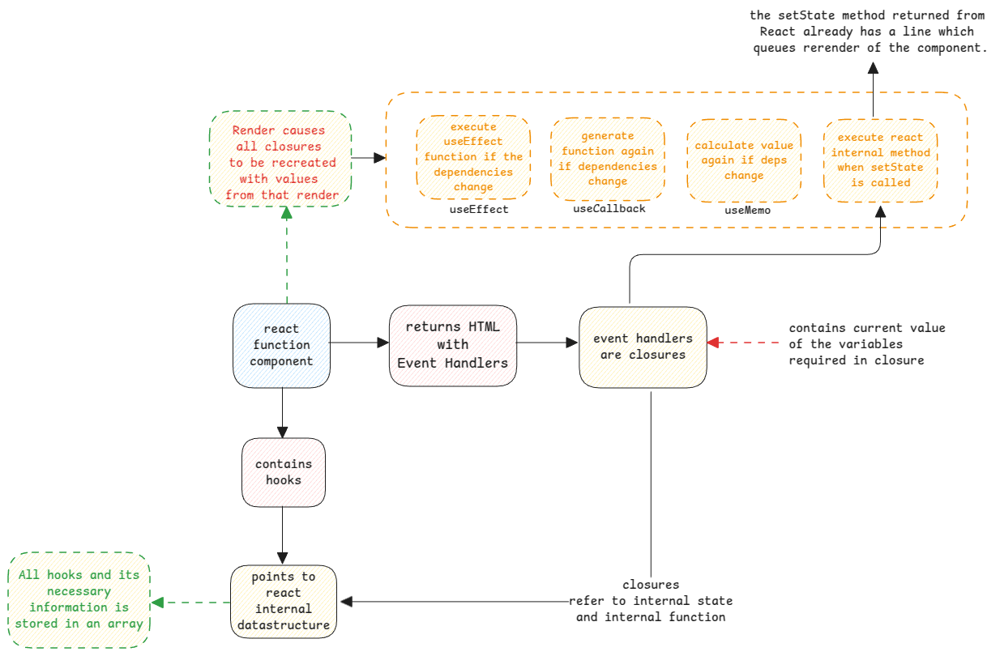

# React Hooks

Hooks provided by the React framework is the only way to hook the application with the react framework.

:::important hooks are just another functions.
Hooks are just another functions which are simply executed whenever the component is rendered.
:::

## ReactJS hooks and JavaScript closures

All ReactJS hooks are internally using closures.
This is achieved by creating closures during the rendering using the current values of the render.
It uses this to compare the new values, store current values and re-render as necessary.

## useCallback

This hook is used to cache the [object Id](../javascript/functions.md) of the function itself.
This is important because the creation of a new reference of a child function happens always
when the parent function is called.

:::danger How React uses child functions
In react, every component is just a JavaScript function.
So all functions inside it are child functions.
This means, for every re-render, a new reference for child function is created.
:::

Since re-render causes functions to be created again,
if we pass the function to lower components as parameters, it will unnecessarily re-render those child components.
This is where useCallback is useful.

:::tip useCallback implementation
When a component re-renders, the useCallback method is called and
then this method compares old function body with new function body and additionally compares the dependencies too.
:::

## useEffect

This is again just another method which is executed whenever the component is rendered.

The useEffect method then executes the function passed in the first argument,
if the values of the dependencies have changed.
The old dependency values are stored in the ReactJS's internal storage.

## useState

1. Whenever there is a new render, the useState() function returns the current value and a new closure setter method.
2. The returned setter method has also the call to the function
   that queues the re-render of the component using the new state.
   This is executed whenever there is an event that triggers the execution of this setter method.
