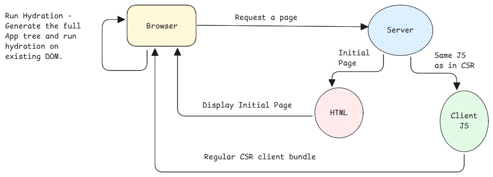

# Server Side Rendering

Server side rendering (SSR)

:::important
In case of CSR, JSX is converted to JS and bundled.
The bundle is executed on browser which then generates the HTML.

In case of SSR, JSX is converted to HTML on the server and returned directly to HTML on server.
But additionally, the same client code that we send as part of CSR is also sent here.  
:::

## Hydration

It's the process in the SSR where the server generated static HTML
is converted to a dynamic page by attaching all necessary
JS script to handle/listen events.

:::tip[Rendering vs Hydration]
ReactDOM.Render() - Attaches complete application to the DOM.

ReactDOM.Hydrate() - Attaches only event handler to the existing DOM.
:::

During hydration, React performs a process called reconciliation
in which it compares the server-rendered DOM with the client-rendered DOM
and tries to identify differences between the two.
If there are differences between the two DOM objects,
React attempts to fix them by re-hydrating the component tree and
updating the component hierarchy to match the server-rendered structure.
And if there are still inconsistencies that can't be resolved,
React will throw errors to indicate the problem.
This problem is commonly known as a **hydration error**.

_Dan Abramov (Ex-React Team) says - Hydration is like watering the “dry” HTML with the “water”
of interactivity and event handlers._

:::important
It's important to note that SSR simulates an environment for rendering a React tree into raw HTML.
It doesn't differentiate between server and client components, and it renders them the same way on server.

But it only renders the static HTML. All dynamic content comes from the hydration process.
:::

## Problems with plain-old SSR

All JavaScript should be downloaded on the client side before starting the hydration
and the hydration process should be completed before the page can become interactive.
Only then even the pre-rendered HTML can be displayed.

This is a “waterfall”: fetch data (server) → render to HTML (server) → load code (client) → hydrate (client).

Neither of the stages can start until the previous stage has finished for the webpage to be fully available for the user.

## New SSR in React 18

### Suspense

Solution to this problem is `Suspense`. It makes only parts of the page to be in `waiting` mode
while the page waits for data to be loaded.

Also, we must consider that for the dynamic components which need data from other sources (DB, API),
then the client script has to still run on the browser to fetch data.

:::info
Suspense allows to throw promises from React components when it needs something that's not ready yet
(fetching data, lazily importing components, etc).
These promises are caught at the **Suspense boundary**.
This means, whenever a promise is thrown from rendering a Suspense sub-tree,
React pauses rendering that sub-tree until the promise is resolved, and then tries again.
:::

**Concepts of Suspense** - Streaming HTML (Pre-rendered and sent over the wire) and Selective Hydration.

1. Streaming Server Rendering - Progressively rendering HTML from the server to the client.
   Whenever suspended parts of the webpage are ready, React them streams the new HTML for this part of the webpage and
   also a script to update DOM.
2. Selective Hydration - React prioritizes what components to make interactive first based on user interaction.

Uses HTML streaming to sending updated HTML chunks as and when the data is processed on the server.

:::tip
More on HTML streaming can be found in this [page](../browsers/html-streaming).
:::

:::info
This concept is also called `flushing`.
In case of RSC, the skeleton or already static generated HTML is flushed out first.
After that the slow components are returned.
:::

## NextJS Page Router

NextJS page router implements SSR.

## Hydration Performance

Hydration has a performance impact the page is too big.
React will have to skim through the entire page and attach event listeners.

This is why even for static websites like blogs, SSR isn't a good solution.
Instead, RSC is better as it will generate the static HTML fully on server
and hydration would be avoided on such pages.

## Useful Terms

1. _TTFB_ - Time to First Byte - When the first byte is received by the browser from web server.
   This isn't useful for the end user.
2. _FCP_ - First Contentful Paint - When the first HTML element is displayed.
   First effect to the end user that the webpage is loading successfully.
3. _TTI_ - Time To Interactive - When the webpage is responding to user interaction.

:::note
Content inspired and curated using

- [Server Components in React (joshwcomeau.com)](https://www.joshwcomeau.com/react/server-components/)
- [React 18: Server Components Discussion #37 (reactwg/react-18)](https://github.com/reactwg/react-18/discussions/37)
- A must-read for every beginner.
- [How DCL and FCP Affect SEO (cloudflare.com)](https://www.cloudflare.com/learning/performance/how-dcl-and-fcp-affect-seo/)
- [How React Server Components Work (plasmic.app)](https://www.plasmic.app/blog/how-react-server-components-work)
- [Hydration in React (neonpie.xyz)](https://neonpie.xyz/hydration/)
- [Next.js Discussions: SSR and Hydration (vercel/next.js)](https://github.com/vercel/next.js/discussions/60935)

:::
