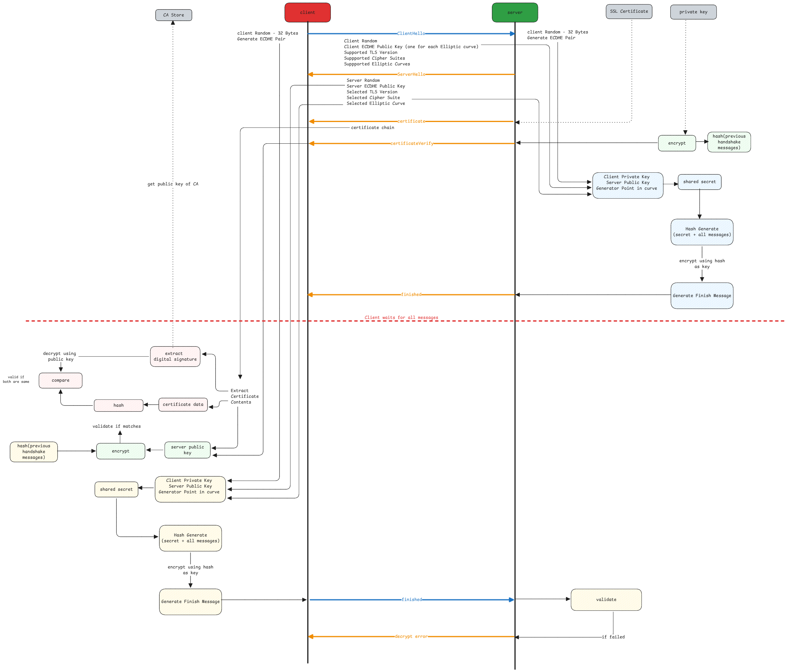

# SSL

Secure Sockets Layer (SSL) is a protocol for establishing a secure connection between a client and a server.

:::important What SSL achieves
SSL does two things.
One is about authentication the server by the client.
The other is about encrypting the data exchanged between the client and server.

It's considered as **authentication**
because the client can be sure that it's talking to the right server.
:::

## Certificate and Trust

The first step of trust is established when the client receives a certificate from the server.
The certificate contains the server's public key and is signed by a trusted Certificate Authority (CA).

1. The public key is used initially to verify if the server really has the corresponding key.
2. The digital signature in the certificate is used by client to confirm
   if the certificate was really provided by the CA which the client trusts.

:::important x.509 format
It's the format of the certificate's content.
Look at it like a JSON schema which describes the message structure.
:::

## SSL Handshake Process



## Certificate Verification

1. The CA signs by generating an hash of the certificate contents.
2. The CA uses its private key to encrypt the hash.
3. The encrypted hash is included in the certificate.
4. The hash algorithm used to hash the certificate is also included in the certificate.

The client then first decrypts the signature using the public key of the CA.
Then it hashes the certificate contents using the same hash algorithm.
Finally, it compares the decrypted signature with the newly generated hash.

**This is a combination of hashing and encryption technologies.**

## ECDHE Key Pair

This is an **ephemeral** key pair that's generated on both client and server sides when a new TLS connection is started.

- **Private Key** - A very high random number. Generated using standard random number generators.
- **Public Key** - Generated by multiplying the private key by another huge number.
  This another huge number is a fixed universally known value.

:::danger Only public keys are transferred
In the entire handshake process,
only the public keys are transmitted over public networks.

Shared secrets, private keys, symmetric encryption key all remain local.
The algorithm's ensure that both sides can generate the same secret values on both sides.
:::

```javascript
PublicKey = PrivateKey × G

Where G is the **generation point**.
It has a known x and y co-ordinates in a graph.
```

:::warning why is this secure?
The numbers are huge that, just by knowing the public key and the fixed number,
it's impossible to get the exact private number by division.

In an elliptic curve, private and public key values define the curve.
G defines a specific value in the curve.
Adding G to G multiple times gives another point in the graph which is no where near to the original G's co-ordinates.

It's extremely important to note that this isn't a multiplication which is done on linear scale.
It's done on an elliptic curve where the addition of two points gives a third point in the curve.
This is exactly why, finding private key from public key is tough.
:::
