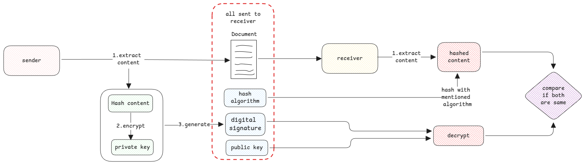

# Digital Signatures

Digital signatures are also involve public and private keys
but it doesn't work similar to how things work in SSL.

## Authenticity and Integrity

It's only used to prove if the message came from a specific sender and the content isn't tampered.

If it's necessary to prove that the message came from a specific sender,
then the public key isn't sent in the signature.
The public key can be then taken for the sender from a relevant registry.

:::danger data isn't encrypted
The actual data itself isn't encrypted.
Digital signatures only help to ensure that the data what was generated at source is the same what was received.
:::

:::warning digital signature and e-signature aren't same
What we do with adding signatures in PDF are e-signatures.
They **NOT** digital signature.
:::
