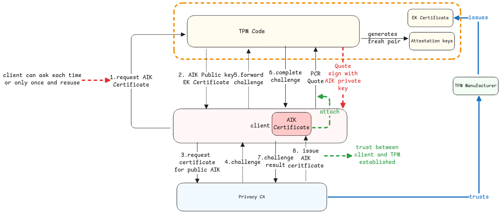

# Trusted Platform Module (TPM)

TPM is a chip on the motherboard that provides security functions.

It's important to keep in mind that TPM is just a tamper proof recorder.
Neither does TPM does any verification of the data that's written to it nor
the systems writing data to it does any verification.

:::tip **platform** in TPM
The word "platform" in TPM refers to the entire hardware and software that's running on the
computer on which the TPM is hosted.

It provides a way to secure everything that's running on that platform.
:::

## Endorsement Key

This is a certificate generated by the TPM manufacturer to identify a physical device.

## Platform Configuration Register (PCR)

This is the volatile memory of the TPM.
The data here is written by each component of the platform during boot.
Each component in the boot chain, measures the next component that it's going to execute
and writes the hash of that measurement to a specific PCR slot.

:::danger Component doesn't measure itself
Each component measures the next component that it's going to execute.
:::

It basically represents the state of the platform at a given time.

:::important who writes to PCR?
The PCR is written to by the platform components, such as the BIOS, bootloader, and
operating system, BitLocker PIN, etc.

The standards are defined already on who writes to which block of PCR.
So every underlying part of the platform is aware of what and where it should write to PCR.
:::

Every part of the platform that writes to PCR, always calculates the state of the next component
that it will execute and creates an **hash** of that component
and write to its PCR slot.
This means, any small change will change the hash and thus the PCR value.

## Extending Values

A specific PCR value of a slot is updated by multiple stages of the boot process.

Example, the operating system will extend the PCR value with the hash of the kernel,
and then the kernel will extend it with the hash of the initrd, systemd and many more.
This is done using the `TPM2_Extend` command, which appends the new hash to the existing PCR value.
This way, the PCR value is a cumulative hash of all the components that have been measured during the boot process.

:::warning Initial values of PCR indexes
Initial value of PCR is always 0x00.
This is set during the reboot of the system.
:::

## Use cases of TPM

1. Sealed key - for locally running applications.
2. Attestation - for remote verification of PCR values.

## PCR Quotes and Attestation

PCR quotes is nothing but the current values of PCR values.
But the quote isn't returned as is.
It's [digitally signed](digital-signatures) using the private AIK of the client requesting it.
The verifier then gets the corresponding certificate from client and
verifies the signature and then trusts the PCR quote values.

Attestation key is only for digitally signing.
It's never used for encryption.

:::tip Why Attestation Needed?
Attestation here is same as the real world attestation, where a trusted entity verifies the authenticity of a claim.

In this case, the certificate is issued by TPM, attested by privacy CA and verifier relies on attestation.

Real world example - College issues certificate, Government Authority attests it, third party relies on the attestation.
:::

### Attestation Process

Each client of the TPM must ask for it's own AIP Public and private key pair.
The client gets the public key (similar to SSL CSR)
and send this to privacy CA to get a certificate for it.

All quote responses are then signed with this private key from TPM
and the response's digital signature is verified using the public key.

## Sealed Key

This is a feature that's used to protect sensitive data using TPM.
This is the feature used by BitLocker to encrypt the disk encryption key.
The sealed key feature can be used by any application to

:::important Sealed Key Generation and Reading

**Generation** - Send key to be sealed -> Encrypt Key -> Attach PCR values -> Return Sealed Key.

**Reading** - Send Sealed Key -> Decrypt Key -> Verify PCR values -> Return original key if PCR values match.

Here, the system asking for a sealed key must inform which PCR values must be used to seal the key.
This is nothing but the PCR policy.
:::
