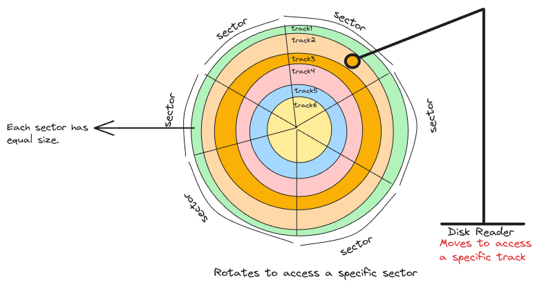

# Disks

## Hard Disk Drives (HDD)

They're mechanical drives and the entire disk is divided into tracks and sectors
and the intersection between tracks and sectors are the [blocks](../computers/memory-paging#block-and-page-size).

This is nothing but the smallest unit of storage.
Example, if the sector size is 4KB.
Then even if you want to create an empty file, on the hard disk a block of 4KB is allocated to it.

## Physical vs Logical Sector Size

Sometimes even though the physical sector size is 4KB,
for various reasons there is also a logical sector size which can be just 512 bytes.
This is useful for example, when we need to store too many small files.

This means, the OS/kernel will only work with the assumption that every block is 512 bytes.
But the firmware of the storage then manages the mapping of logical sector address blocks to physical sector addresses.

:::danger how firmware manages writing data
Even though the physical sector size is more than logical sector size and
OS will send write requests to logical sector address,
the firmware will then load the physical sector of that corresponding logical sector
into it's buffer and then update that full physical sector and write it back.
:::

## IO Size vs Sector Size

IO size refers to the maximum size of data that can be handled within a single read or write operation.
Whereas, sector size is the smallest unit of data that can be addressed and read in the storage.

For instance, if the I/O size is 4096 bytes and the logical sector size is 512 bytes,
up to eight logical sectors can be processed in one go.
This batching reduces overhead and improves throughput.

## Disk Hardware

It's interesting to know that the storage disks comes with an inbuilt
firmware and a micro controller which executes this firmware.

This firmware is responsible for logical to physical sector mappings,
LBA (Logical Block Addressing) mappings, processes read and write requests from CPU and many more.

:::tip data transfer process
when CPU asks for data at a specific location,
it's the firmware that then translates the address, picks the data and
places it in the memory.
:::

:::info useful links

[Anatomy of a Hard Disk Drive](https://hardwaresecrets.com/anatomy-of-a-hard-disk-drive/)

:::
