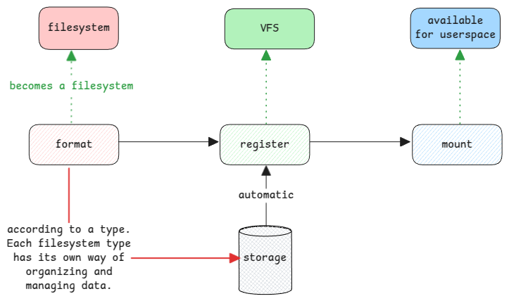
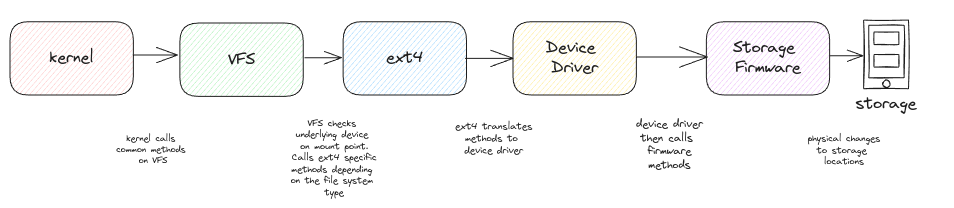

# Filesystems

## Filesystem vs Filesystem Type

**Filesystem Type** is a specific implementation of storing and organizing data in physical storage.
During formatting, a normal storage device is then with super blocks on how the underlying storage is managed.

**Filesystem** is what a plain storage becomes after it's formatted.

:::note: class vs instance
Filesystem type is the class and a filesystem is an object of it.

The filesystem type software then decides how it would like to use this plain storage.
:::

## Reading data from storage

Reading a file from storage goes through multiple layers of software abstraction.

## Preparing Disks

### Formatting a disk

When we format a disk,
it basically means the storage is prepared to be used by a specific software such as ext4, NTFS, FAT, etc.
This means, the disk's header blocks are written with certain filesystem specific information and
also mounting status.

:::tip format to ext4
It means the clearing the existing data and
creating super block of that storage, root inode information, etc.

For the underlying storage, super block and other information are just stored in a regular place.
It has no special meaning for the storage hardware itself.
:::

### Map filesystems to mount points

**fstab** file has the mapping of all filesystems to different directory
in the full file structure hierarchy.

This file shows which storage system is mounted at which directory.

:::tip filesystem information at boot
When system boots, all hardware is detected and using the data at **/etc/fstab**
they're mounted (linked) to different directories and
depending on the filesystem type in this file, the VFS then speaks to the underlying
storage system to get files and directories information.
:::

### Mounting a filesystem

The filesystem information exists in the OS files always.
Irrespective of whether the disk is physically present or no.
But only after the mounting the disk, the files will be accessible in the address mentioned in the inode structure.

So mounting a filesystem actually means, the underlying storage of the filesystem is now available for the kernel to access.

## Storage Software

### Device Drivers

These are the common methods called by the filesystem code such as ext4 or NTFS irrespective of the underlying device.
If the underlying disk is an SCSI disk, then the SCSI driver is used.

### Storage Firmware

These are the storage manufacturer methods invoked by device drivers.
These methods are mostly about reading and writing data at the specified block address.

## Splitting Disks

### Partition

A physical disk can be logically split into multiple logical disks and
each logical disk can be formatted into a completely different filesystem.

:::tip transparent to hardware
This partitioning of the physical storage is completely transparent to the
storage and it's firmware.
:::

### Logical Volumes

Volumes are virtual disks. Means, multiple physical disks are grouped and shown as a single disk to the operating system.
There is a logical volume manager that sits on top and handles all the mapping of files to underlying blocks.

## Storage without a filesystem

There are use cases where the disks can exist without any filesystem, means the block storage is used as it is.

For example, some databases use the block devices as it's and manage the blocks themselves.
Same also with LVMs in Linux.
The disks are used as plain block devices and the filesystems are created at the logical volume level.

## Filesystem block size

It's the minium size used by the filesystem to manage files.
This means, if the block size is 4KB, even a file with just one letter with block 4KB space on storage.
Mostly the size of the block is kept same as the physical sector size for better performance.

:::danger sector sizes vs filesystem block sizes
sectors sizes are something managed by the firmware.
:::
