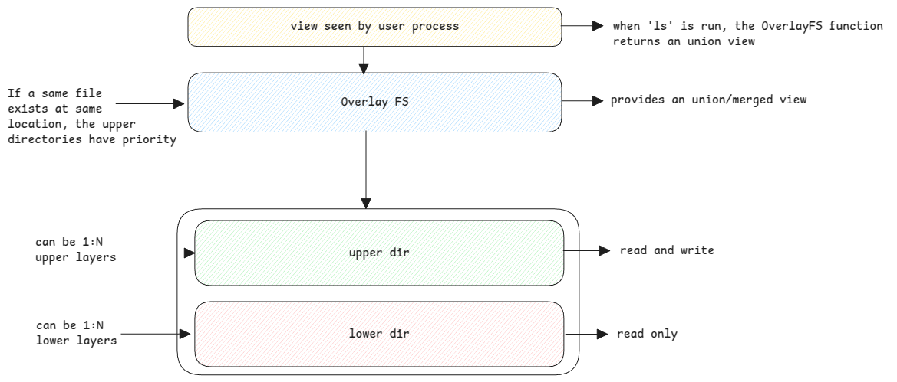

# Overlay File System

Overlay file system is a feature of Linux.
It's simply another [file system](./file-system) type similar to EXT4.
This means, when a directory is mounted with type as **overlay**,
then the VFS calls the read and write function provided by the OverlayFS.

:::warning how it's used in docker
Each layer in a docker image is mounted as a lower layer.
This is why more the layer, bigger the size of the image.

Docker simply creates a new mount namespace and creates this OverlayFS inside that namespace.
:::
