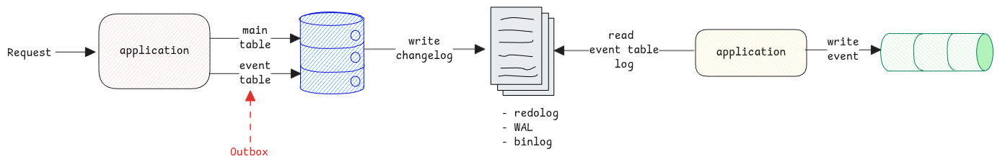

# Change Data Capture

It's a system design technique where the change logs from database are read and
used to publish an event to be consumed by other system.

:::important database change log content
The database change logs from the database contains the full data that was written to the database.
:::

## Outbox Pattern

Outbox pattern is an system design pattern where request is stored in the database which is the **outbox**.
Then there is another system which polls this outbox table and sends it to a message queue or another service.

:::tip achieves atomicity
The main advantage this pattern brings is the atomicity.
If the same application writes to database and also to a queue,
atomicity can't be achieved since they're not in a single database transaction.
:::

CDC is an extension or implementation of outbox pattern,
where the second system doesn't poll the database.
Instead, reads the insert logs for the **outbox** table from the database change logs and
writes it to the queues. Thereby it saves the constant polling of the change table.

:::warning reading change logs
CDC tools will either use the database provided libraries to read from specific log sequence or
use standard system calls to read the file from where it read last.

The later option is exactly how the **tail** command works.
Knows the last offset position from the file's starting address and
then keeps polling or waits for OS events to see if there is new data on the file.
:::

## Separate Event Table

A separate event table is necessary for the following reasons:

1. To avoid writing metadata to the main table to achieve separation of concerns.
2. The event table can be purged to keep it small always.
