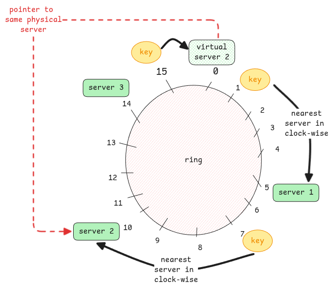

# Consistent Hashing

It's a system design concept which is used in load balancing and partitioning in distributed systems.

:::important why the name consistent?
Here consistent means, the hashing is implemented in such a way that,
even if new servers/partitions are added, still the existing generated hashes **mostly** remain same as before.
This is where the **consistency** comes from.
:::

## Regular Hashing

In regular hashing, if there are 5 partitions, then each partition is given a value from 0 to 4.
Then for a specific key, the hash function then generates an integer value and then **mod 5** is applied to the same.
This value then determines the partition to which the data will be put into.

Now, when a new server is added, there will be 6 partitions and
then **mod 6** will be applied.
But **mod 6** will then change hash values of many existing data and
this means a lot of data must be moved/migrated to new partition IDs generated by the new hash function.

```shell
server = hash(key) % number_of_servers
```

:::warning problems with regular hashing

1. The **mod N** depends always on the size of the partition.
   So adding and removing partitions will always lead to lot of data migration.
2. Irrespective of how good the hash function is, applying **mod** on it at the end will always create same issues.
   :::

## What consistent hashing does differently?

This solution brings in consistency by ensuring any additions or deletions to partitions
won't lead to too many changes in data position.
It achieves this by removing the use of **mod**.
Instead it uses the same hash function to generate the positions of the servers on the ring
as well as the keys.

Important to keep in mind - Items are placed on a circular track and
the item goes to the nearest box available in the clockwise direction.

:::tip size of the key in reality
Normally the size of the key is a 32 or 64 bit integer.
Meaning, the allowed positions are $$2^{32}$$.
Hence not very often the ring is full.
:::



:::info use of virtual nodes
In case there is lot of keys being assigned to the same server,
we split create virtual copies of it and use the same hash function to determine its position.
:::
