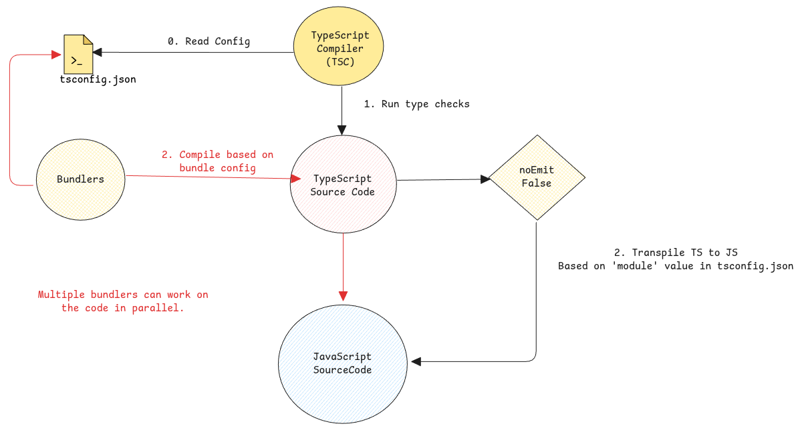

# TypeScript Compiler

The default compiler from TypeScript is called the `tsc`.
It's the main compiler which can is aware of the complete type system and
can do type checks as part of the compilation process.

Other bundlers such as Webpack or Vite does the transpilation on its own but doesn't do type checks.

