{/* GENERATED FILE - don't edit by hand. Run `task generate-map` to refresh. */}

# Knowledge Map

This map shows every topic I've written about. Each note sits under a parent area, so the breadth and the depth are clear at a glance.

It covers 261 notes across 27 topics.

```mermaid
mindmap
  root((Knowledge))
    AI & Math
      AI
        Agents Levels
        Bm25
        Embedding Models
        Next Token Prediction
        Terminologies
        Tools
        Training
        Vocabulary
        Weights
      Algorithms
        Big O
        Bit Masking
        Euclidean Gcd
        Graph Search
        Greedy Algorithms
        Heuristic
        Kmp
        Monotonic Stack
        Patterns
        Recursion
        Sorting
        Subarray Sum
        Topological Sort
      Mathematics
        Binary Arithmetic
        Boolean Alegbra
        Combinatorics
        Common Denominator
        Complement
        Logarithms
        Matrix Multiplication
        Modular Arithmetic
        Notations
        Number Series
        Number System Conversion
        Number Terminology
        Percentiles
        Roots
        Scientific Notation
        Sine Cosine
    Data
      Data Model
        Json Ld
        Ontology
        Semantic Web
        Serialization Formats
        Variable Length
      Data Structures
        Bloom Filters
        Expression Trees
        Graphs
        Hash Tables
        Hash Trees
        Stacks
        Trees
      Databases
        Indexes
        Inverted Indexes
        Joins
        Locking
        Lsm Trees
        Mvcc
        Prepared Statements
        Save Points
        Sharding Partitioning
        Spatial Indexes
    Distributed Systems
      Blockchain
        Bitcoin
        Block Chain
        Blocks
        Smart Contracts
      Event Driven
        Kafka
        Rabbitmq
      Network
        Anycast
        Arp
        Gateway
        Ip Address
        Keep Alive
        Nat
        Routing
        Switching
        Tcp Udp
      System Design
        Acid
        Cap
        Cdc
        Consistent Hashing
        Event Sourcing
        Lru
        N Plus 1 Query
        Parallel Change
        Quorum
    Frontend & Web
      Browsers
        Cache Control
        Cookie
        Core Web Vitals
        Cors
        Html Streaming
        I18n
        Polling Methods
        Referrer
        Request Forging
        Sessions
      Bundlers
        Babel Vs Webpack
        Environment Variables
        Vite
        Why Bundlers
      CSS
        Align Justify Items
        Css Modules
        Css Positions
        Css Selectors
        Keyframes
        Margin Padding Border
        Pseudo Concepts
        Tailwind
      HTML
        Aria
        Block Inline
      Javascript
        Closures
        Functions
        Global Objects
        Hoisting
        Html Vs Dom
        Lexical Environment
        Modules
        Promises
        Runtime
      React
        Controlled Components
        Hooks
        Jsx
        Lazy Loading
        React Rendering Types
        Ref
        Rendering Vs Updating Dom
        Rsc
        Server Side Rendering
      Typescript
        Absolute Vs Relative Imports
        Tsc
        Tsconfig
    Infrastructure
      Containers
        Docker Daemon
        Isolation
        Lxc Containers
        Mount Namespace
        Network Namespace
        Privileged
      Git
        Branches
        Commit History
        Data Structures
        Folder Structure
      Kubernetes
        Auth
        Health Probes
        Ingress
        Operators
        Pause
        Persistent Storage
        Pods
        Volumes
    Programming Languages
      Go
        Embedded Structs
        Interfaces
        Method Sets
        Modules
        Pointers
        Receivers
        Routines
        Terminologies
      Java
        Async Servlets
        Atomic
        Bom
        Byte
        Bytes To String
        Class Loading
        Class Proxies
        Code Execution
        Concepts
        Files
        Garbage Collection
        Interpreter
        Jpa
        Jpa Transactions
        Lambdas
        Non Blocking Io
        Numeric Promotion
        Phases Goals
        Platform Independency
        Ports Sockets
        References
        Scope
        Scope
        Servlet Containers
        Settings
        Signed Integers
        Ssl
        Streams
        String Builder
        Synchronized
        Thread Communication
        Threads
        Todo
        Virtual Machine
    Security
      Security
        Asymmetric Symmetric
        Digital Signatures
        Hashing
        Oidc Oath
        SSL
        Ssi
        Tpm
    Systems & OS
      Computers
        64 Architecture
        Bit Manipulation
        Buffer
        Character Sets
        Chipset
        Clocks
        Context Switching
        Cpu Caching
        Cpu Components
        Decimals
        Device Drivers
        Dma
        File Compression
        Floating Point
        Fragmentation
        Function Calling
        Futex
        Hashing
        Kernel At Boot
        Matrices
        Memory Calcuations
        Memory Locking
        Memory Paging
        Mmio
        Multiplexers
        Pci
        Process Memory
        Projections
        Ram
        Rings
        Semaphores
        Time
      Linux
        Bind Mounts
        Boot Directory
        Boot Process
        Dbus
        Device Manager
        Epoll
        File Permissions
        Grub
        Initrd
        Interrupts
        Namespaces
        Network Devices
        Posix
        Processes
        Sockets
        Ssh
        Ssh Agent
        Standard Streams
        Syscalls Compile Execute
        Systemd
        Terminals
        Usr Directory
      Physics
        Current Flow
        Earthing
        Electrical Energy
      Storage
        Disks
        File Descriptors
        File Systems
        Inodes
        Overlay Fs
        Rootfs
        Temporary File System
        Virtual File Systems
```

