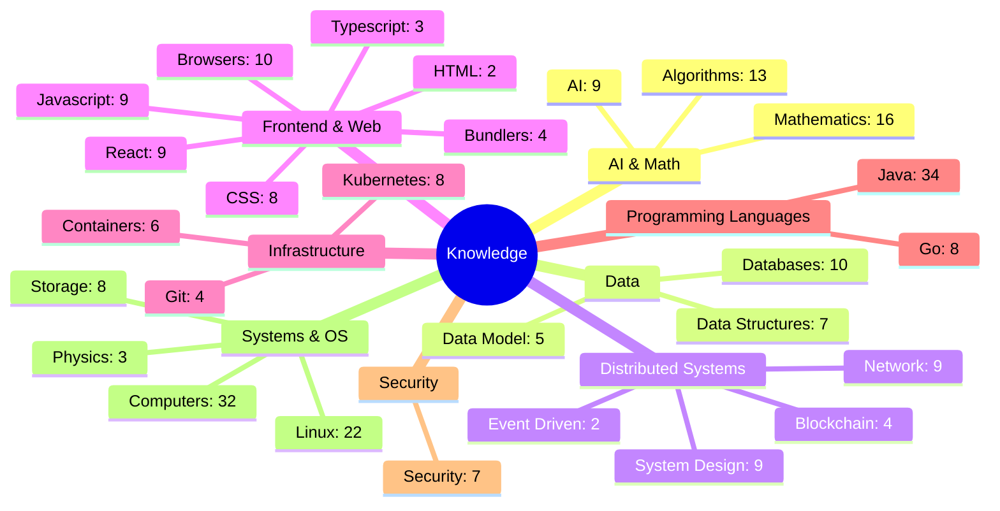

# Knowledge Map

This map shows how broad and deep my notes go.
Each topic sits under a parent area. The count shows how many notes it holds.

It covers 261 notes across 27 topics.

_Generated from the docs folder. Run `task generate-map` to refresh._
